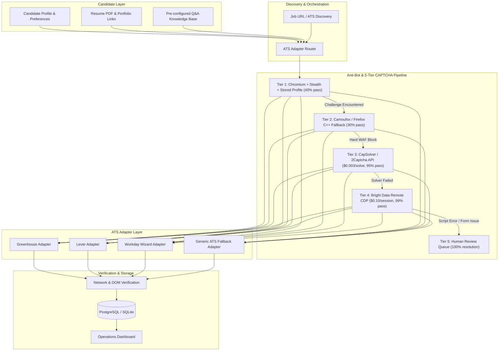
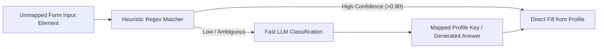

# AI-Native Job Application Automation & 5-Tier CAPTCHA Bypass Engine
## System Architecture & Technical Blueprint for Future Implementation

---

## 1. Executive Summary & High-Level Architecture

This document specifies the complete end-to-end design, directory structure, data models, adapter patterns, and 5-tier anti-bot bypass strategy for building an **AI-Native Job Application Automation System** (modeled after enterprise architectures like 360Labs).

### High-Level Architecture Flow



---

## 2. Complete Project Directory Structure

```
ai-job-automation/
├── config/
│   ├── settings.py                  # Pydantic v2 application settings
│   ├── ats_selectors.yaml           # Heuristic DOM selectors per ATS provider
│   └── proxies.yaml                 # Tiered proxy pools (DC, Residential, Mobile)
├── src/
│   └── job_automation/
│       ├── __init__.py
│       ├── candidate/
│       │   ├── __init__.py
│       │   ├── profile.py           # Candidate profile data structures
│       │   ├── parser.py            # Resume PDF parser & structured JSON extractor
│       │   └── qa_engine.py         # Dynamic question-answering with LLM fallback
│       ├── browser/
│       │   ├── __init__.py
│       │   ├── manager.py           # Browser lifecycle & profile manager
│       │   ├── stealth.py           # DOM anti-detection evasion scripts (150+ hooks)
│       │   ├── profiles/            # Persistent browser profiles (cookies, localStorage)
│       │   └── remote_cdp.py        # Bright Data / Browserless CDP connector
│       ├── captcha/
│       │   ├── __init__.py
│       │   ├── detector.py          # Real-time DOM challenge detector
│       │   ├── tier_manager.py      # 5-tier escalation coordinator
│       │   ├── solvers/
│       │   │   ├── capsolver.py     # CapSolver API connector (Turnstile/reCAPTCHA)
│       │   │   ├── twocaptcha.py    # 2Captcha fallback connector
│       │   │   └── audio_whisper.py # Zero-cost local Whisper audio solver
│       │   └── manual_queue.py      # Tier 5 human operator dispatch
│       ├── adapters/
│       │   ├── __init__.py
│       │   ├── base.py              # AbstractBaseATSAdapter
│       │   ├── router.py            # Automatic ATS detection by URL & DOM
│       │   ├── greenhouse.py        # Greenhouse.io adapter (iframe & direct)
│       │   ├── lever.py             # Lever.co adapter
│       │   ├── workday.py           # Workday multi-step account & wizard adapter
│       │   ├── ashby.py             # AshbyHQ modern React form adapter
│       │   └── smartrecruiters.py   # SmartRecruiters adapter
│       ├── mapper/
│       │   ├── __init__.py
│       │   ├── heuristics.py        # Regex & semantic field matching
│       │   ├── llm_mapper.py        # Small fast LLM for ambiguous custom fields
│       │   └── normalizer.py        # Phone, address, country, work authorization
│       ├── pipeline/
│       │   ├── __init__.py
│       │   ├── worker.py            # Async application dispatch worker
│       │   ├── verifier.py          # HTTP interceptor & DOM confirmation checker
│       │   └── reporter.py          # Screenshot capture & audit trail logger
│       └── storage/
│           ├── __init__.py
│           ├── models.py            # SQLAlchemy / SQLModel database entities
│           ├── repository.py        # Database operations
│           └── migrations/          # Alembic migrations
├── frontend/                        # Next.js / Tailwind cockpit interface
│   ├── src/
│   │   ├── app/
│   │   ├── components/
│   │   │   ├── CandidateProfileCard.tsx
│   │   │   ├── ApplicationTable.tsx
│   │   │   ├── ManualReviewModal.tsx
│   │   │   └── LiveBrowserStream.tsx
│   │   └── lib/
├── tests/
│   ├── test_adapters.py
│   ├── test_captcha_waterfall.py
│   ├── test_field_mapper.py
│   └── test_stealth.py
├── pyproject.toml
├── Dockerfile
└── README.md
```

---

## 3. The 5-Tier Anti-Bot & CAPTCHA Escalation Strategy

The core technical differentiator is the **cost-escalating waterfall**. Rather than paying API costs on every submission, the system routes tasks from cheapest to most capable:

| Tier | Technology | Pass Rate | Cost per Run | Best Used For |
|---|---|---|---|---|
| **Tier 1** | Chromium + Playwright Stealth + Persistent Session | ~40% | **$0.00** | Standard static forms, unblocked Greenhouse/Lever jobs |
| **Tier 2** | Native Firefox / Camoufox (Gecko engine) | +30% (~70% cumulative) | **$0.00** | Cloudflare Turnstile passive challenges, Chrome CDP flags |
| **Tier 3** | CapSolver / 2Captcha API Token Solvers | +25% (~95% cumulative) | **~$0.001–0.003** | Explicit reCAPTCHA v2/v3, hCaptcha, interactive Turnstile |
| **Tier 4** | Bright Data Scraping Browser (Remote CDP) | +4% (~99% cumulative) | **~$0.05–0.10** | Workday, Akamai Enterprise, heavy behavioral bot protection |
| **Tier 5** | Operator Review Queue + Screenshot Fallback | +1% (**100%**) | Operator time | Broken forms, SMS verification, custom multi-factor gates |

### Tier Escalation Implementation Pattern

```python
class WaterfallExecutionCoordinator:
    """Orchestrates 5-tier escalation for job application submissions."""

    async def execute_application(
        self,
        job_url: str,
        candidate: CandidateProfile,
        adapter_cls: Type[BaseATSAdapter],
    ) -> ApplicationResult:
        # ── Tier 1: Chromium + Stealth + Stored Profile ──
        try:
            res = await self._run_in_chromium_stealth(job_url, candidate, adapter_cls)
            if res.status == "success":
                return res
        except AntiBotChallengeDetected:
            logger.info("Tier 1 triggered challenge. Escalating to Tier 2 (Firefox)...")

        # ── Tier 2: Camoufox / Firefox C++ Engine ──
        try:
            res = await self._run_in_firefox_stealth(job_url, candidate, adapter_cls)
            if res.status == "success":
                return res
        except AntiBotChallengeDetected:
            logger.info("Tier 2 blocked. Escalating to Tier 3 (API Solver)...")

        # ── Tier 3: External Token Solver API (CapSolver / 2Captcha) ──
        try:
            res = await self._run_with_token_solver(job_url, candidate, adapter_cls)
            if res.status == "success":
                return res
        except Exception:
            logger.info("Tier 3 failed. Escalating to Tier 4 (Bright Data Scraping Browser)...")

        # ── Tier 4: Remote Scraping Browser over CDP ──
        try:
            res = await self._run_via_remote_cdp(job_url, candidate, adapter_cls)
            if res.status == "success":
                return res
        except Exception as e:
            logger.warning(f"Tier 4 failed: {e}. Escalating to Tier 5 (Manual Review Queue)...")

        # ── Tier 5: Operator Review Queue ──
        return await self._enqueue_for_manual_review(job_url, candidate, adapter_cls)
```

---

## 4. ATS Adapter Architecture

Each applicant tracking system has unique DOM structures, iframe conventions, and event validation rules. All adapters inherit from an abstract base class:

### Abstract Base Adapter Interface

```python
from abc import ABC, abstractmethod
from typing import Dict, Any, Optional
from playwright.async_api import Page

class AbstractBaseATSAdapter(ABC):
    def __init__(self, page: Page, candidate_profile: "CandidateProfile"):
        self.page = page
        self.candidate = candidate_profile

    @abstractmethod
    async def can_handle(self, url: str, dom_html: str) -> bool:
        """Determines if this adapter is the correct handler for the URL/page."""
        pass

    @abstractmethod
    async def fill_personal_details(self) -> None:
        """Fills Name, Email, Phone, Location, Social Profiles."""
        pass

    @abstractmethod
    async def upload_documents(self, resume_path: str, cover_letter_path: Optional[str] = None) -> None:
        """Uploads candidate resume and cover letter PDFs."""
        pass

    @abstractmethod
    async def answer_custom_questions(self, qa_knowledge_base: Dict[str, Any]) -> None:
        """Handles work authorization, demographic questions, and open text fields."""
        pass

    @abstractmethod
    async def submit_and_verify(self) -> SubmissionVerificationResult:
        """Clicks submit button, monitors network responses, and verifies confirmation."""
        pass
```

### Specific ATS Adapter Profiles

1. **Greenhouse Adapter (`GreenhouseAdapter`)**:
   - Handles embedded iframes (`iframe#grnhse_iframe`) and direct `boards.greenhouse.io` URLs.
   - Key inputs: `#first_name`, `#last_name`, `#email`, `#phone`, `input[type="file"]#resume`.
   - Form submission listener: intercepts `POST /applications` response to confirm JSON status `200`.

2. **Lever Adapter (`LeverAdapter`)**:
   - Handles `jobs.lever.co/{company}/{job_id}/apply`.
   - Unified `input[name="name"]` requiring split or combined name formatting.
   - Dynamic custom fields (EEO checkboxes, salary expectations, custom radio buttons).

3. **Workday Adapter (`WorkdayAdapter`)**:
   - Multi-step stateful wizard (`myworkdayjobs.com`).
   - Requires dynamic account creation or guest checkout handling.
   - Handles multi-page progression: Step 1 (My Information) → Step 2 (My Experience) → Step 3 (Application Questions) → Step 4 (Review & Submit).

---

## 5. Smart Form Field Mapping Engine

To adapt to novel or custom company questions, the system combines **fast heuristic regex rules** with an **LLM fallback**:



### Heuristic Matcher Rules Matrix

| Field Type | Heuristic Target Attributes (`name`, `id`, `placeholder`, `aria-label`) | Candidate Profile Value |
|---|---|---|
| **First Name** | `first.*name`, `fname`, `given.*name` | `candidate.first_name` |
| **Last Name** | `last.*name`, `lname`, `family.*name`, `surname` | `candidate.last_name` |
| **Full Name** | `^name$`, `full.*name`, `candidate.*name` | `f"{candidate.first_name} {candidate.last_name}"` |
| **Email** | `email`, `e-mail` | `candidate.email` |
| **Phone** | `phone`, `mobile`, `tel`, `cell` | `candidate.phone_formatted` |
| **LinkedIn** | `linkedin`, `social.*network`, `profile.*url` | `candidate.linkedin_url` |
| **GitHub** | `github`, `git.*url` | `candidate.github_url` |
| **Portfolio** | `portfolio`, `website`, `personal.*site` | `candidate.portfolio_url` |
| **Work Auth** | `legally authorized`, `sponsorship`, `visa` | Evaluated against `candidate.work_authorization` |
| **Resume** | `input[type="file"][accept*="pdf"]`, `#resume` | `candidate.resume_file_path` |

---

## 6. Verification & Self-Healing Pipeline

To ensure the application was genuinely received (and not rejected by hidden validation errors):

1. **Pre-Submit Validation Audit**:
   - Scans DOM for HTML5 validation flags: `:invalid`, `[aria-invalid="true"]`, `.has-error`, `span.error`.
   - If detected, highlights missing field, attempts re-fill, and logs warning.

2. **Network Response Interception**:
   - Hooks Playwright's `page.on("response", ...)` to watch application submission POST/PUT endpoints.
   - Checks HTTP status code (200, 201, 204 = pass; 400, 422 = validation error; 403 = anti-bot block).

3. **Confirmation Screen OCR / Text Verification**:
   - Asserts presence of success text: `"Thank you for applying"`, `"Application submitted"`, `"We've received your application"`.
   - Captures and stores full-page screenshot as verification artifact.

---

## 7. Operations Dashboard (Cockpit)

The UI layer provides real-time visibility into the automation pipeline:
- **Active Roles / Opportunities Table**: Company, Role, ATS Type, Tier Used, Status.
- **Conversion Funnel**: Applied → Phone Screen → Interview → Offer.
- **Tier Performance Metrics**: Success rates and cost tracking across Tier 1 through Tier 5.
- **Manual Review Queue**: Interactive iframe/screenshot viewer allowing human operators to clear blocked submissions in under 30 seconds.

---

## 8. Implementation Roadmap (When Building in the Future)

When ready to construct this feature, execute in four sequential phases:

### Phase 1: Core Foundation & Data Layer
- [ ] Create `CandidateProfile` Pydantic models and resume parser.
- [ ] Implement `AbstractBaseATSAdapter` and initial `GreenhouseAdapter`.
- [ ] Add `ats_selectors.yaml` configuration.

### Phase 2: Form Automation & Heuristic Engine
- [ ] Build `FieldMapper` with regex heuristics for common ATS inputs.
- [ ] Implement file upload automation (`set_input_files`) for PDF resumes.
- [ ] Add `LeverAdapter` and `AshbyAdapter`.

### Phase 3: Anti-Bot & 5-Tier Escalation
- [ ] Wire existing `growx_crawl/crawler/stealth` modules into `WaterfallCoordinator`.
- [ ] Add remote CDP connection support for Bright Data / Browserless (Tier 4).
- [ ] Integrate verification screenshot capture on completion.

### Phase 4: Operations Console & Manual Review
- [ ] Build Next.js management dashboard with application tracking table.
- [ ] Implement Tier 5 manual review modal with live browser state resumption.
- [ ] Add analytics for pass rates and solver expenditure.
